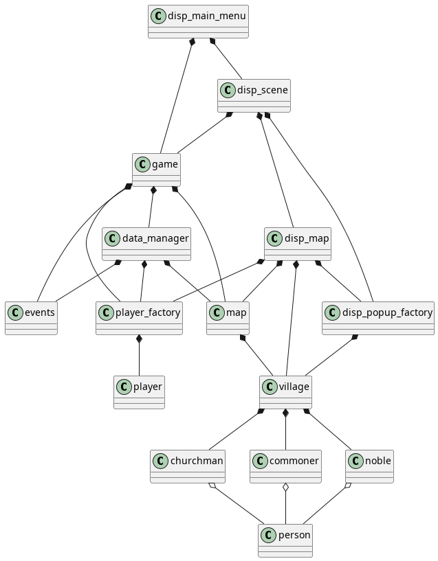

# ProjetIHM
projet IHM 2024

les names & first-names .txt proviennent du repo git si dessous:
https://github.com/dominictarr/random-name.git 

Le projet est egalement disponible sur github a l'adresse: 
https://github.com/IvanoBalboni/projetIHM

Pour lancer le jeu, executer la commande `python3 disp_scene.py` depuis `/src`.

## Avancee du projet
Nous n'avons pas pu implementer les changement de tours et la decision des bots qui va avec.

la graine de generation aleatoire se fait depuis data_manager.py, il s'agit de l'attribut `self.seed`

la classe disp_popup_factory sert a produire les differentes popup avec lesquels le joueur peut interagir.

En cas de tentative d'achat de case ou de creation de village sans les ressources necessaires un message indique l'erreur.

En ouvrant une pop up avec click droit celle-ci s'adaptera pour rester sur un cote de la souris tout en restant dans l'ecran. 

## Diagramme de classe

